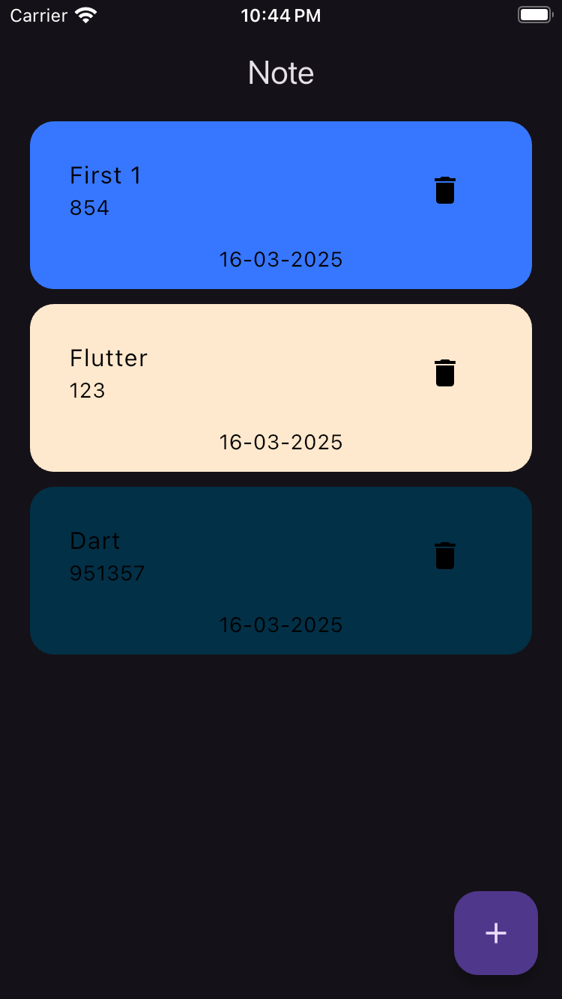

  

  
  
  

  <a href="#-features">Features</a> •
  <a href="#-screenshots">Screenshots</a> •
  <a href="#-architecture">Architecture</a> •
  <a href="#-installation">Installation</a> •
  <a href="#-license">License</a>

---

## ✨ Features
- 📝 **CRUD Operations**: Create, Read, Update & Delete notes instantly
- 🚀 **Hive Database**: Lightning-fast local storage with encryption
- 🎨 **Clean Architecture**: MVVM pattern with BLoC state management
- 🔍 **Smart Search**: Find notes quickly with powerful search
- 🎮 **Undo/Redo**: Mistake-friendly editing experience
- 🌓 **Dark/Light Theme**: Automatic system theme detection
- 📲 **Cross-Platform**: Works on Android, iOS, and Web

---

## 📸 Screenshots

| Home Screen | Add Note | Delete Note |
|-------------|----------|-------------|
|  |  |  |

---